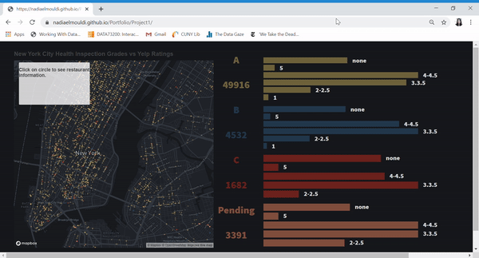

# Portfolio
This repository will include documentation and and links for my Interactive Data Visualisation projects:

## [Project 1: New York City Restaurants Health Inspection Grades VS Yelp Ratings](https://nadiaelmouldi.github.io/Portfolio/Project1/)  
This project puts in contrast the New York City Resturants Helath Inspection grades with the restaurant's Yelp ratings. I was intirgued by whether New York City restaurants which did not have good health inspection grades still had good yelp ratings from people.  I combined the Health Inspection by Restaurant  dataset from the NYC Open Data website with the Yelp rating that I extracted using the Yelp API (using longitude, latitude, restaurant name, street address).
  

### Earlier Versions  
  

### Data
Health Inspection Data from NYC Open Data. [Link](https://data.cityofnewyork.us/Health/DOHMH-New-York-City-Restaurant-Inspection-Results/43nn-pn8j)  
Yelp Ratings from [Yelp API](https://www.yelp.com/developers/documentation/v3/business)  
Map created with [Mapbox](https://www.mapbox.com/)
### Link to artifacts from Design Process  
Link to initial sketches and mockup [here](https://github.com/NadiaElMouldi/Portfolio/tree/master/Project1/Sketches%20and%20Mockups)
 

## [Project 2: Women Writers from the Middle East and North Africa: A Repository](https://nadiaelmouldi.github.io/Portfolio/Project2/)  
This project is a repository for women writers from the Middle East and North Africa. I think this repository provides a consolidated space for women writer from MENA to be discovered and read. I compiled the data from multiple online sources like Arablit.org and Wikipedia.com. The data includes name, introduction, date of birth, some book highlights. 

### Earlier Versions

  

### Link to artifacts from Design Process
Link to initial sketches and mockups [here](https://github.com/NadiaElMouldi/Portfolio/tree/master/Project2/Sketches%20and%20Mockup)

## Reflection  
I wrote a reflection about why and how I chose to work on the Women Writers project. Check it out [here](https://medium.com/@nadiaelmouldi/reflecting-on-women-writers-from-the-middle-east-and-north-africa-a-repository-e383ccfdaaac?source=friends_link&sk=9dab3aab876b5aa6b7c9cb20ca377715)

